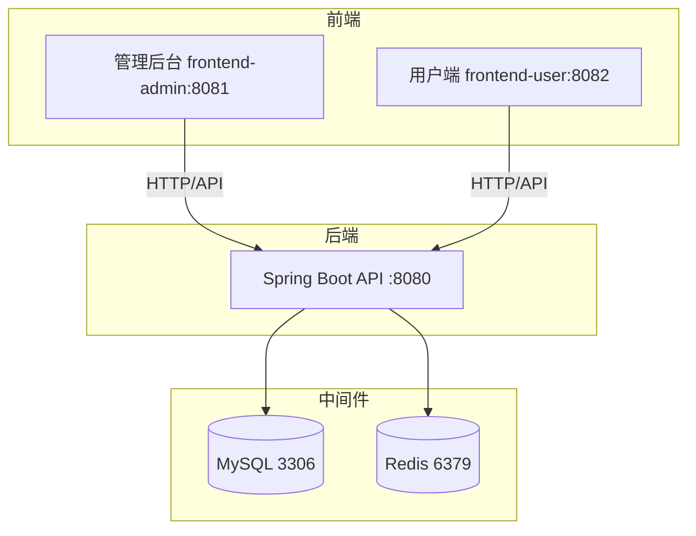
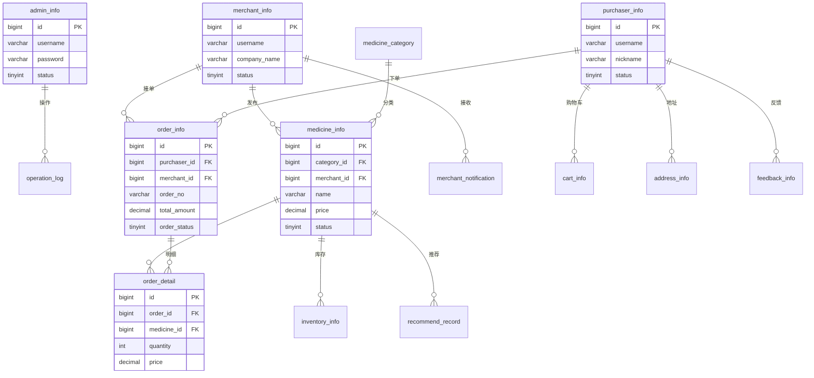

# 药材销售管理系统 - 项目设计文档

## 0. 技术栈

| 层级 | 技术 | 说明 |
|------|------|------|
| 前端 | Vue 3 + Vite | 管理后台、用户端 |
| 前端 UI | Element Plus | 组件库（Element UI 的 Vue 3 版本） |
| 后端 | Spring Boot | REST API |
| 数据库 | MySQL 8.0 | 持久化 |
| 缓存 | Redis | 推荐缓存、会话等 |

## 1. 系统架构

## 2. ER 图

## 3. 接口清单

### AuthController `/api/auth`

| 方法 | 路径 | 说明 |
|------|------|------|
| POST | /login | 登录 |
| POST | /register/purchaser | 采购商注册 |
| POST | /register/merchant | 商户注册 |
| POST | /logout | 登出 |

### AdminController `/api/admin`

| 方法 | 路径 | 说明 |
|------|------|------|
| GET | /dashboard | 首页概览 |
| GET | /merchants | 商户分页 |
| POST | /merchants | 创建商户 |
| PUT | /merchants | 更新商户 |
| PUT | /merchants/{id}/audit | 审核商户 |
| PUT | /merchants/{id}/status | 商户状态 |
| GET | /purchasers | 采购商分页 |
| POST/PUT | /purchasers | 采购商增改 |
| PUT | /purchasers/{id}/status | 采购商状态 |
| GET | /medicines | 药材分页 |
| GET | /medicines/{id} | 药材详情 |
| POST | /medicines | 创建药材 |
| PUT | /medicines | 更新药材 |
| DELETE | /medicines/{id} | 删除药材 |
| PUT | /medicines/{id}/status | 药材审核/上下架 |
| GET/POST/PUT/DELETE | /categories | 分类管理 |
| GET | /orders | 订单分页 |
| GET | /orders/{id} | 订单详情 |
| GET/POST/PUT/DELETE | /banners | 轮播图 |
| GET/POST/PUT/DELETE | /announcements | 公告 |
| GET/PUT | /configs | 系统配置 |
| GET | /inventory/low-stock | 库存预警 |
| GET | /price-history/{id} | 价格历史 |
| GET | /feedbacks | 用户反馈 |
| PUT | /feedbacks/{id}/reply | 回复反馈 |
| PUT | /feedbacks/{id}/close | 关闭反馈 |
| GET | /operation-logs | 操作日志 |

### MerchantController `/api/merchant`

| 方法 | 路径 | 说明 |
|------|------|------|
| GET | /profile | 商户信息 |
| PUT | /profile | 更新商户 |
| GET | /dashboard | 商户概览 |
| GET | /notifications | 通知列表 |
| PUT | /notifications/{id}/read | 已读通知 |
| GET | /medicines | 药材列表 |
| GET | /medicines/{id} | 药材详情 |
| POST | /medicines | 添加药材 |
| PUT | /medicines | 更新药材 |
| PUT | /medicines/{id}/on-shelf | 上架 |
| PUT | /medicines/{id}/off-shelf | 下架 |
| DELETE | /medicines/{id} | 删除药材 |
| GET | /orders | 订单列表 |
| GET | /orders/{id} | 订单详情 |
| PUT | /orders/{id}/ship | 发货 |
| GET | /inventory/low-stock | 库存预警 |
| GET | /price-history/{id} | 价格历史 |

### PurchaserController `/api/purchaser`

| 方法 | 路径 | 说明 |
|------|------|------|
| GET | /profile | 个人信息 |
| PUT | /profile | 更新信息 |
| GET | /medicines | 药材分页 |
| GET | /medicines/{id} | 药材详情 |
| GET | /medicines/hot | 热门药材 |
| GET | /medicines/recommend | 个性化推荐 |
| POST | /recommend/click | 记录推荐点击 |
| GET | /cart | 购物车 |
| POST | /cart | 加入购物车 |
| PUT | /cart/{id} | 更新数量 |
| DELETE | /cart/{id} | 删除 |
| DELETE | /cart | 清空 |
| POST | /orders | 创建订单 |
| GET | /orders | 订单列表 |
| GET | /orders/{id} | 订单详情 |
| PUT | /orders/{id}/pay | 支付 |
| PUT | /orders/{id}/receive | 收货 |
| PUT | /orders/{id}/cancel | 取消 |
| POST | /orders/review | 评价 |
| GET/POST/PUT/DELETE | /addresses | 地址管理 |
| PUT | /addresses/{id}/default | 设为默认 |
| GET | /collections | 收藏列表 |
| POST | /collections/{id} | 收藏/取消 |
| POST | /feedback | 提交反馈 |

### CommonController `/api/common`

| 方法 | 路径 | 说明 |
|------|------|------|
| GET | /banners | 轮播图 |
| GET | /categories | 分类列表 |
| GET | /announcements | 公告列表 |
| GET | /medicines | 药材分页（公开） |
| GET | /medicines/{id} | 药材详情（公开） |
| GET | /medicines/hot | 热门药材 |

### FileController `/api/common`

| 方法 | 路径 | 说明 |
|------|------|------|
| POST | /upload | 文件上传 |

## 4. UI/UX 规范

| 项目 | 规范 |
|------|------|
| **主色调** | #FF7A45（橙红） |
| **主色悬浮** | #ff9566 |
| **成功色** | #52C41A |
| **警告色** | #FAAD14 |
| **危险色** | #F5222D |
| **正文色** | #333333 |
| **次要文字** | #8C8C8C |
| **边框色** | #EEEEEE |
| **背景色** | #F5F7FA |
| **卡片背景** | #FFFFFF |
| **字体** | 系统默认（-apple-system, BlinkMacSystemFont, "Segoe UI", Roboto） |
| **标题字号** | 20px / 600 |
| **正文字号** | 14px |
| **卡片圆角** | 12px |
| **按钮圆角** | round（全圆角）或 8px |

## 5. 功能实现说明

以下列出各功能在代码中的实现位置，便于查阅与评审。

### 5.1 采购商收货地址管理

| 层级 | 文件 | 说明 |
|------|------|------|
| 后端接口 | `PurchaserController` | GET/POST/PUT/DELETE `/purchaser/addresses`，PUT `/addresses/{id}/default` |
| 后端服务 | `AddressServiceImpl` | 增删改查、设为默认、清除默认 |
| 前端页面 | `frontend-user/src/views/purchaser/Addresses.vue` | 地址列表、新增/编辑弹窗、删除、设为默认 |
| 数据表 | `address_info` | 收货人、省市区、详细地址、是否默认 |

### 5.2 商户资质审核

| 层级 | 文件 | 说明 |
|------|------|------|
| 后端接口 | `AdminController` | PUT `/admin/merchants/{id}/audit` |
| 后端服务 | `AdminServiceImpl.auditMerchant` | 根据 status 通过/拒绝 |
| 前端页面 | `frontend-admin/src/views/MerchantManage.vue` | 商户列表、通过/拒绝、查看资质 |
| 数据表 | `merchant_info` | license_no、license_image、qualification_image、status(0待审核/1通过/2拒绝) |
| 商户注册 | `RegisterMerchant.vue` | 营业执照号、资质图片上传（可选） |

### 5.3 价格异常波动预警

| 层级 | 文件 | 说明 |
|------|------|------|
| 后端逻辑 | `MedicineServiceImpl` | `isPriceAbnormal` 判断涨跌幅是否超过阈值，`notifyPriceAbnormal` 发送商户通知 |
| 配置项 | `system_config` | `price_abnormal_rate`（默认 0.3，即 30%） |
| 阈值设置 | `frontend-admin/src/views/PriceAnalysis.vue` | 价格分析页顶部「价格异常波动预警阈值」卡片，可修改比例（0.01~1） |
| 系统配置 | `frontend-admin/src/views/SystemConfig.vue` | 亦可编辑 price_abnormal_rate |
| 触发时机 | 药材创建/更新/商户调价 | 价格变动时自动检测 |

### 5.4 协同过滤推荐

| 层级 | 文件 | 说明 |
|------|------|------|
| 用户相似度 | `MedicineServiceImpl.calculateUserSimilarity` | 与 README 五.2 设计一致：获取采购记录→匹配相似用户→计算余弦相似度 |
| 推荐生成 | `MedicineServiceImpl.generateRecommendListFromSimilarity` | 筛选高相似度用户，取其采购药材，过滤已购，按销量排序 |
| 相似度计算 | `MedicineServiceImpl.cosineSimilarity` | 两个采购记录集合的余弦相似度（Set 去重） |
| 数据查询 | `OrderMapper.getPurchasedMedicineIds` | 某采购商已购药材 ID 列表（对应 prompt 中 getPurchaseMedicineIds） |
| 数据查询 | `OrderMapper.getSimilarPurchasers` | 购买过相同药材的其他采购商（需传入 purchaserId 排除自身） |
| 推荐逻辑 | `MedicineServiceImpl.getRecommendList` | 基于相似采购商的购买记录推荐，无数据时按分类兜底 |
| 定时刷新 | `RecommendTask` | 每小时刷新各采购商推荐缓存 |

### 5.5 库存预警

| 层级 | 文件 | 说明 |
|------|------|------|
| 数据查询 | `InventoryMapper.selectLowStockInventories` | 库存 ≤ 预警阈值的记录 |
| 定时任务 | `InventoryWarningTask` | 每小时检查，写入 Redis、发送商户通知 |
| 管理接口 | `AdminController`、`MerchantController` | GET `/inventory/low-stock` |

### 5.6 系统日志

| 层级 | 文件 | 说明 |
|------|------|------|
| 切面记录 | `OperationLogAspect` | 拦截 Controller 方法，记录操作人、模块、动作等 |
| 后端接口 | `AdminController` | GET `/admin/operation-logs` 分页查询 |
| 前端页面 | `frontend-admin/src/views/OperationLogManage.vue` | 按模块、关键词筛选 |
| 数据表 | `operation_log` | operator_type、module、action、detail 等 |

### 5.7 用户反馈

| 层级 | 文件 | 说明 |
|------|------|------|
| 提交 | `PurchaserController` | POST `/purchaser/feedback` |
| 管理 | `AdminController` | GET `/feedbacks`、PUT `/feedbacks/{id}/reply`、PUT `/feedbacks/{id}/close` |
| 前端页面 | `frontend-admin/src/views/FeedbackManage.vue` | 列表、回复、关闭、详情 |
| 数据表 | `feedback_info` | type、title、content、status、reply、reply_time |
